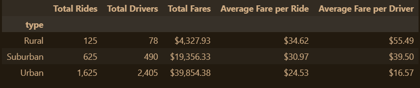
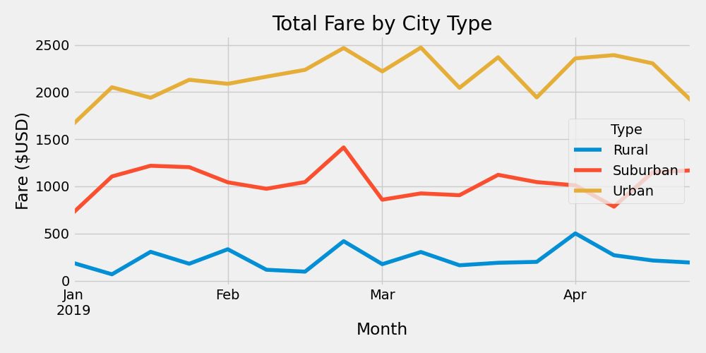

# Pyber Ride Sharing Analysis
## Overview
PyBer, a $2.3 billion ride-sharing company, sought to examine trends in ride-share data between January and May 2019. The datasets included the following fields:

* city
* driver_count
* type
* date
* fare
* ride_id

### Objective
The objective of the analysis was to detect variations in ride-sharing patterns across different city types, which would inform PyBer's decision-making process. The primary focus was on enhancing the availability of ride-sharing services and assessing affordability for underserved areas.

### Analysis
#### Ride-Share DataFrame
Initially, the two datasets, city_data.csv and ride_data.csv, were combined using the city variable to create a single dataframe. Subsequently, `groupby` was employed to generate new series variables summarized by city type. The derived series were integrated into a new dataframe, which was formatted to display ride-share data according to city type.

#### Weekly Total Fares by City Type
Utilizing `groupby` once again, a new dataframe was constructed with 'type' and 'date' as the indices and the sum of fares for each date. The index was reset, and the `pivot()` function was applied to create a pivot table with 'date' as the index, 'type' as columns, and 'fare' as values. The table was filtered to display rides only between January 1, 2019, and April 28, 2019. After transforming the index to a datetime data type, `resample()` and `sum()` were used to aggregate the data into weeks and compute the total fares. A plot was generated to showcase the total weekly fares by city type.

## Results
#### Ride-Sharing by City Type Table
The table derived from the analysis is presented below.

As demonstrated in the table, urban cities have the highest total rides, total drivers, and total fares. Nonetheless, the average fare per ride in urban cities is lower compared to suburban and rural cities. In contrast to suburban and rural cities, urban cities possess a higher number of total drivers than total rides.

#### Weekly Total Fares by City Type Plot
The resulting plot from the analysis is displayed below.

In line with the table mentioned earlier, the plot illustrates that urban cities generated the highest total fares on a weekly basis. All city types experienced a surge in total fares during the third week of February. Throughout the selected period, rural cities exhibited the least fluctuation in total fares, while urban cities displayed the most significant variation.

## Summary
In conclusion based on the findings, recommendations can be provided to address the discrepancies in ride-sharing across different city types.

### Recommendations
1. Concentrate advertising efforts and investments in urban cities to boost ridership. Urban cities have a surplus of drivers that can accommodate an increase in passengers.
2. Expand the driver base in rural and suburban regions. These markets tend to have longer rides, which may lead to extended waiting times, discouraging potential customers from using the service. Incentivizing drivers with bonus pay for being in rural and suburban regions could accomplish this. 
3. Implement a higher rate per mile or minute for rides during peak times in urban areas. This approach would raise the average fare per ride and help bridge the gap between urban and suburban or rural markets.

